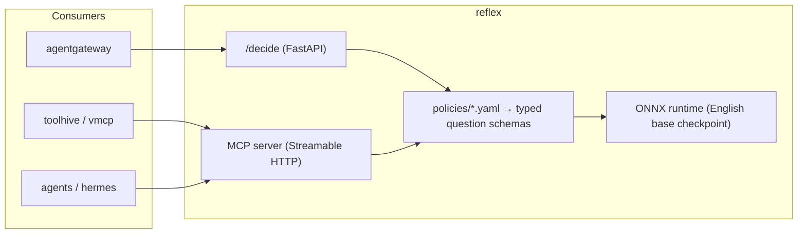

# reflex

[](https://github.com/soulwhisper/reflex/actions/workflows/ci.yaml)
[](LICENSE)

A **System-1 decision layer** for homelab and self-hosted platforms: give it a
state and typed questions, it returns calibrated routing decisions in a single
forward pass — **no generation, no parsing, no hallucination**.

Built on [`convaiinnovations/laya`](https://huggingface.co/convaiinnovations/laya)
(System-1 decision models, Apache-2.0), packaged as a production service:
YAML policies in, MCP/HTTP routing decisions out.



## What it routes

| Policy | Decision | Example |
|---|---|---|
| `mcp` | which MCP server / backend should handle a request | karakeep vs hindsight vs netbox vs obsidian |
| `tool` | which tool inside a chosen server, plus relevance score | `find_bookmarks` vs `search_notes` |
| `profile` | which agent profile should take the message | ops vs chat vs default |

All three are `choice`-type questions with calibrated probabilities — schemas
live in `policies/*.yaml`, so new routes ship without retraining. When base
accuracy isn't enough, the **production fine-tune path** (shadow traffic →
domain dataset → fine-tune → repackage) produces your own checkpoint, the same
way `laya-typed-decisions` derives from `laya`.

## What it is not

- **Not an embedding service** — no vectors; use TEI for embeddings.
- **Not a reranker** — `score` primitives can rank candidates, but a dedicated
  cross-encoder reranker is the right tool for large candidate sets.
- **Not an LLM** — it cannot chat, summarize, or generate anything.
- **Not a guardrail** — never sits in a deny path; deny-path scanning belongs
  to fail-closed sidecars (e.g. mcp-guardrails).
- **Not enforceable pre-fine-tune** — the bundled base checkpoint is
  advisory/shadow-only. Live measurements (2026-09-25, see
  [docs/EVALUATION.md](docs/EVALUATION.md)): correct top-1 on clear routes,
  but borderline confidence is far below enforcement grade and CPU latency
  is ~1 s/decision. Do not gate traffic on it until a fine-tuned,
  temperature-refit checkpoint is promoted.

## Quickstart

```bash
pip install -r requirements.txt
uvicorn app.server:app --host 0.0.0.0 --port 9000
```

```bash
curl -s localhost:9000/decide/mcp -d '{"state": {"text": "what did I bookmark about cilium last week"}}'
# {"policy":"mcp","answer":{"choice":"karakeep","probability":0.91},...}
```

Docker / Kubernetes: see [Dockerfile](Dockerfile) and [deploy/k8s](deploy/k8s/).

## Runtime: ONNX, no torch

The release image runs **onnxruntime** against the bundled **English base
checkpoint** — the root of [`tozp/laya-onnx`](https://huggingface.co/tozp/laya-onnx)
(`model.onnx` + `tokenizer.json` + `rl_agent_config.json`; the
`laya-typed-decisions` artifact is a separately *tuned* checkpoint and is
deliberately NOT bundled: shadow data must come from the base we intend to
fine-tune) — no torch, no transformers, no CUDA libs. That takes the image
from ~5.4 GB (default PyPI
torch wheel pulls the full nvidia stack) to **~2 GB** fp32, or **~800 MB**
with `--build-arg MODEL_FILE=model_int8.onnx` (measured RSS: fp32 ≈ 2.4 GiB
after warm-up → size pods at ~3 Gi limit; int8 ≈ 0.75 GiB → ~1 Gi limit).
Inference is one forward pass per call; encode/decode mirrors `laya`'s
contract exactly (temperature clamping included), so decisions are
interchangeable with the torch path.

Measured (production nodes: Intel 13900H 6P+8E/96 GB; i3-N305 = dev box,
conservative lower bound; details in [docs/EVALUATION.md](docs/EVALUATION.md)):

| runtime | 13900H (cluster) | N305 (dev) | warm RSS | image |
|---|---|---|---|---|
| torch 0.3.0 (previous) | **0.3–0.6 s** (measured live, 2-CPU limit) | — | ~1.5 GiB | 5.36 GB |
| ONNX fp32 (default) | **~1.0 s** (measured live 2026-09-25, 2-CPU limit) | 9 s (measured) | 2.4 GiB → 3 Gi limit | ~2 GB |
| ONNX int8 (build-arg) | ~1–1.7 s *(inferred)* | 5 s (measured) | 0.75 GiB → 1 Gi limit | ~800 MB |

ONNX fp32 decisions are **bit-identical to the torch deployment** (4/4 cases,
probabilities and confidence to 4 decimals). Current latency is bounded by
the export's static 512-token graph, not the hardware — CPU is adequate for
advisory/shadow traffic; inline high-QPS enforcement (~33 ms on the model
card's T4) wants an accelerator (iGPU/OpenVINO, Apple-silicon host, or cloud
burst).

```bash
# default: tozp/laya-onnx fp32
docker build -t reflex .
# lean variant, or your own fine-tuned export (see finetune/):
docker build --build-arg MODEL_FILE=model_int8.onnx -t reflex .
docker build --build-arg MODEL_REPO=<your-hf-repo> -t reflex .
```

## Decision tracing

Set `OTEL_EXPORTER_OTLP_ENDPOINT` (standard OTEL env vars) and every policy
decision emits one span with `gen_ai.*` attributes — input, choice,
probability, checkpoint — rendered natively as generations in langfuse or
any OTLP backend. The SDK is inert when the endpoint is unset. Raw-schema
calls (`/decide`, `reflex_decide`) are not traced: no policy label, varying
schema, no dataset value.

Shadow deployments MUST set `OTEL_TRACES_SAMPLER=always_on`. The SDK default
(`parentbased_always_on`) drops spans under unsampled parents, and MCP
front-proxies sample aggressively (toolhive: 5%) — that silently shrinks the
shadow dataset to a biased sliver.

This is the shadow-mode log source for step 1 below: spans out, export from
your backend, distill, fine-tune.

## Fine-tuning is a production feature

`reflex` treats fine-tuning as an operational stage, not research:

1. **Shadow mode** — log every decision + the route actually taken.
2. **Distill** — build the domain dataset from traffic logs (teacher = your
   production LLM or rule labels).
3. **Fine-tune** — upstream notebook
   ([laya_finetune_typed_decisions](https://github.com/NandhaKishorM/laya/blob/main/notebooks/laya_finetune_typed_decisions_2xT4_kaggle.ipynb))
   against the dataset; refit temperature on your data (required — base
   checkpoints ship over-confident).
4. **Repackage & promote** — versioned checkpoint into the image, shadow
   again, then enforce.

See [ARCHITECTURE.md](ARCHITECTURE.md) for the design deep dive and
[finetune/](finetune/) for the pipeline contract.

## License

Apache-2.0 (see [LICENSE](LICENSE)). Model weights: Apache-2.0 (Convai
Innovations).
